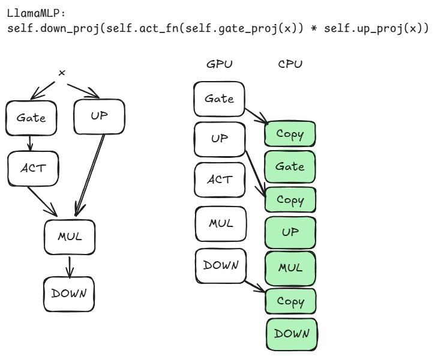

## Verified Large Language Model 

Reimplemented LlamaMLP and LlamaAttention layers to support freivalds verification.

## Usage

### Install

In conda or virtual env, install dependencies. Tested version: conda 25.5.1

```bash
conda env create -f env.yml
pip install -r requirements.txt
```

### Model

Please checkout https://huggingface.co/meta-llama/Llama-3.2-1B-Instruct

### Patch on transformers llama file
To export LlamaAttention and LlamaMLP, we need a temporary patch on the modeling_llama.py file

/PATH/TO/CONDA/envs/verify-llm/lib/python3.12/site-packages/transformers/models/llama/modeling_llama.py

```python
__all__ = [
    "LlamaForCausalLM",
    "LlamaModel",
    "LlamaPreTrainedModel",
    "LlamaForSequenceClassification",
    "LlamaForQuestionAnswering",
    "LlamaForTokenClassification",
    ## export the following as well
    "LlamaAttention",
    "LlamaMLP",
    "apply_rotary_pos_emb"
]
```

### Dataset

c4 test dataset, located in dataset/c4, this is called by verified_llm/utils/dataset_utils.py

- Download large files

```bash
git lfs pull
```

### Test noise  
```
mkdir logs
chmod +x ppl.sh
./ppl.sh
```
The outputs are in logs/ppl-llama-noise-${noise_scale}-limit-${limit_samples}-loss

### Test for end-to-end 

```
python verified_llm/eval.py
```

## Code Structure

- verified_llm: contains all code
- verified_llm/verified_linear.py: reimplement Linear as VerifiedLinear, implement frevalds algorithms.
- verified_llm/attn_layer.py: reimplement LlamaAttention as LlamaAttentionVerify
- verified_llm/mlp_layer.py: reimplement LlamaMLP as LlamaMLPVerify
- verified_llm/eval.py: the main entry functions
- utils/: helpers like dataset functions
- legacy/: old code that is not useful


## Async execution of LlamaMLP



Total operations:

```
gate_proj 
gate_proj_bias
up_proj
up_proj_bias
act_silu
mul_gate_up
down_proj
down_proj_bias
```

Piplined execution with verify operations:  

```
gate_proj 
===
gate_proj_bias & up_proj || copy_gate && verify_gate && gate_proj_bias
===
up_proj_bias && act_silu && mul_gate_up && down_proj|| copy_up && verify_up &&up_proj_bias && act_silu && mul_gate
===
down_proj_bias || copy_down && verify_down && down_proj_bias
```